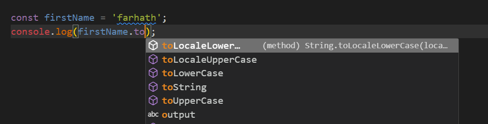

#                       TypeScript               

## Chapters
- Introduction
- The Basics
- Everyday Types

# Intro to TypeScript

TypeScript is an open-source programming language developed and maintained by Microsoft. It is a statically typed superset of JavaScript that compiles to plain JavaScript. TypeScript adds optional static typing to JavaScript, which allows to catch type-related errors at compile time rather than at runtime. 

## Advantages of using TypeScript over JavaScript

- TypeScript always points out the compilation errors at the time of development (pre-compilation). Because of this getting runtime errors is less likely, whereas JavaScript is an interpreted language. 

- TypeScript supports static/strong typing. This means that type correctness can be checked at compile time. This feature is not available in JavaScript. 

- TypeScript is nothing but JavaScript and some additional features i.e. ES6 features. It may not be supported in your target browser but the TypeScript compiler can compile the .ts files into ES3, ES4, and ES5 also. 

## The Basics

### 1. Static type-checking:
    
Static types systems describe the shapes and behaviors of what our values will be when we run our programs. A type-checker like TypeScript uses that information and tells us when things might be going wrong.

   ```bash
         const flower = 'rose'
         flower(); 
   ```
   from the above code we may get error before we try to run the code as "This expression is not callable.Type 'String' has no call signatures." 

2. **Non-exception Failures:**
   
   In TypeScript, non-exception failures typically refer to errors or unexpected behavior that occur during runtime due to issues such as type mismatches, null or undefined values, or logical errors. TypeScript's static type system helps catch many potential errors at compile time, but some failures may still occur during runtime.

   i. 

   ```bash
         const myData = {
         name : 'ayesha',
         age : 23,
      }
      console.log(myData.fullName);
   ```
   here we may get error as Property 'fullName' does not exist on type '{ name: string; age: number; }'.
   In TypeScript, the code produces an error about fullName not being defined

   ii. **Typos:**
    ```bash
            const myFirstName= 'farhath';
      const output = myFirstName.tolowercase();
      console.log(output);
   ```
   error could me "Property 'tolowerCase' does not exist on type '"farhath"'".

   iii.**uncalled functions:**
   ```bash
            function myAge(){
         return Math.random < 0.5;
      }
      console.log(myAge());
   ```
   Operator '<' cannot be applied to types '() => number' and 'number'. It meant to be Math.random()

   iv.**basic logic errors:**
    ```bash
      const value = Math.random() < 0.5 ? "a" : "b";
      if (value !== "a") {
      // ...
      } else if (value === "b") {
      This comparison appears to be unintentional because the types '"a"' and '"b"' have no overlap.
      //...
      }
   ```
      TypeScript's type checking, which is pointing out that the comparison in the else if block is logically impossible because if value is not equal to "a", it must be "b" according to the ternary expression that defines value.

3. **Types for Tooling**
    
   In TypeScript, the type-checker has the capability to verify if we're accessing the correct properties on variables and other objects. With this knowledge, it can also offer suggestions about which properties you might intend to use.

   This aspect allows TypeScript to be utilized for code editing purposes as well. The fundamental type-checker can provide real-time error messages and code completion suggestions as you type in your code editor. 

  
      

   TypeScript takes tooling seriously.An editor that supports TypeScript can deliver “quick fixes” to automatically fix errors, refactoring to easily re-organize code, and useful navigation features for jumping to definitions of a variable, or finding all references to a given variable. All of this is built on top of the type-checker and is fully cross-platform, so it’s likely that our editor has TypeScript support available.

4. **tsc- How to install typscript?**
    
 -    ```bash
      npm install -g typescript
      ```

- Now let’s move to an empty folder and try writing a sample TypeScript program: hello.ts:
   ```bash
   cosole.log("Hello farhath");
   ```
- Now run the command 
  ```bash
    tsc hello.ts
   ```

- As we can see nothing had happen. It means there is no errors.so we didn’t get any output in our console since there was nothing to report.
  But if we check we got one new file called "hello.js". That's the output when we run this command. As it Transforms it into a plain JavaScript file. and the code is also same.
  The compiler tries to emit clean readable code that looks like something a person would write. While that’s not always so easy, TypeScript indents consistently, is mindful of when our code spans across different lines of code, and tries to keep comments around.

- What if we get errors how it look.Now lets rewrite the above code
  
  ```bash
      function greet(name: string, age: number){
      console.log(`Hello ${name}, your age  is ${age}`);
      }
      greet('farhath');
  ```
  If we run tsc hello.ts again, notice that we get an error on the command line!
  ```bash
  Expected 2 arguments, but got 1.
  ```
  TypeScript is telling us we forgot to pass an argument to the greet function.

5. **Explicit Types**
   
    When we use explicit typing, we are telling TS exactly what type we expect the variable to be and TS will take that type only.

    ```bash
       let myName:string;
           myName = 'tiger';
   ```
   The above variable will only take string type. If we give value as number we will see error.

   ```bash
      function greet(name: string, age: number){
      console.log(`Hello ${name}, your age  is ${age}`);
      }
      greet('farhath','apple');
   ```
   Error: "Argument of type 'string' is not assignable to parameter of type 'number'". Here the second argument should pass with type of number as we define it as number type.

6. **Implicit Type** 
   
   It infer the type of variable bases on its initialization value.
   ```bash
    let myNumber = 42;
   ```
   In this case, TS refers that myNumber is of type number because of it is initialized with value 42 which is number.
   But it can sometimes lead to unexpected type errors if the inferred type is not what intended.

7. **Erased Types**
   
    An "erased type" typically refers to a situation where type information is intentionally removed or ignored during compilation or runtime. 

    ```bash
      function greet(name: string, age: number){
      console.log(`Hello ${name}, your age  is ${age}`);
      }
      greet('farhath', 23);
    ```

    When we compile with tsc to output js
    ```bash
               function greet(name, age) {
            console.log(`Hello ${name}, your age  is ${age}`);
         }
         greet('farhath', 23);
    ```
   we can see that name and age parameters no longer have type annotations(:);


8. **Strictness**
      
   TypeScript, "strictness" primarily relates to the level of type checking and adherence to coding conventions enforced by the TypeScript compiler.

   TypeScript offers several compiler options that control strictness. These options enable developers to specify how strictly they want TypeScript to enforce type safety and coding practices
   ```bash
   "strict": true
   ```
   We can write this in tsconfig.json file.By this we can toggles them all on simultaneously, but we can opt out of them individually. The two biggest ones we should know about are noImplicitAny and strictNullChecks.

   i. **noImplicitAny**
     This option flags any variable with an implicit any type, requiring developers to explicitly declare the type of all variables. This promotes stronger type safety and prevents unintended behavior caused by the any type.

   ii. **strictNullChecks**
      When enabled, TypeScript performs strict null checks to prevent null or undefined values from being assigned to variables unless explicitly specified. This helps eliminate null reference errors at runtime.

   iii. **alwaysStrict**
      Enabling this flag ensures that TypeScript emits strict mode directives ('use strict';) in all emitted JavaScript files, promoting better interoperability with modern JavaScript environments.


## Everyday Types

### 1. The primitives: string, number, and boolean

JavaScript has three very commonly used primitives: string, number, and boolean. Each has a corresponding type in TypeScript. 

- **string** represents string values like "welcome people"
- **number** is for numbers like 42. JavaScript does not have a special runtime value for integers, so there’s no equivalent to int or float - everything is simply number.
- **boolean** is for the two values true and false.

### 2.non-primitive data types

Non-primitive data types can hold more collections of complex values. 

- #### Array
  
  An array is a special type of data type which can store multiple values of different data types sequentially using a special syntax. TypeScript supports arrays, similar to JavaScript. There are two ways to declare an array

  i.Using square brackets. This method is similar to how you would declare arrays in JavaScript.

  ```
   let fruits: string[] = ['Apple', 'Orange', 'Banana'];
   console.log(fruits);
  ```
  Arrays can be declared and initialized separately.

  ```
      let fruits: string[] ;
      fruits=['Apple', 'Orange', 'Banana'];
      console.log(fruits);
   ```

  ii. Using a generic array type, Array<elementType>.

   ```
   let fruits: Array<string> = ['Apple', 'Orange', 'Banana'];
   console.log(fruits);
   ```

   Both methods produce the same output. ['Apple', 'Orange', 'Banana']

  iii. An array in TypeScript can contain elements of different data types.

  ```
  let arr = [1, 3, 'Apple', 'Orange', 'Banana', true, false];
  console.log(arr);
  ```

  MultiTypes arrays

  ```
   let values: (string | number)[] = ['Apple', 2, 'Orange', 3, 4, 'Banana']; 
   console.log(values);

   let values1: Array<string | number> = ['Apple', 2, 'Orange', 3, 4, 'Banana'];
   console.log(values1); 
  ```

**Accessing Array Elements:**

The array elements can be accessed using the index of an element ArrayName[index]. The array index starts from zero, so the index of the first element is zero, the index of the second element is one and so on.

  ```
   let fruits2: string[] = ['Apple', 'Orange', 'Banana']; 
   console.log(fruits2[0],fruits2[1],fruits2[2]);
  ```

**Array Methods**

| Method       | Description                                                                       |
|----------    |---------------------------------------------------------------------------------------|
| pop()        | Removes the last element of the array and returns that element.                       |
| push()       | Adds new elements to the array and returns the new array length.                      |
| sort()       | Sorts all the elements of the array.                                                  |
| concat()     | Joins two arrays and returns the combined result.                                     |
| indexOf()    | Returns the index of the first match of a value in the array (-1 if not found).       |
| lastIndexOf()| Returns the last index of an element in the array.                                    |
| slice()      | Extracts a section of the array and returns the new array.                            |
| toString()   | Returns a string representation of the array.                                         |

Examples:
   
   ```
      let fruits3: Array<string> = ['Apple', 'Orange', 'Banana']; 

      // Sort
      console.log(fruits3.sort());  // Output: [ 'Apple', 'Banana', 'Orange' ]

      // pop
      console.log(fruits3.pop());   // Output: Orange

      // push
      console.log(fruits3.push('Papaya')); 
      console.log(fruits3);    // Output: ['Apple', 'Banana', 'Papaya']

      // Concatenate
      console.log(fruits3.concat(['Fig', 'Mango'])); // Output: ['Apple', 'Banana', 'Papaya', 'Fig', 'Mango'] 


      // indexOf
      console.log(fruits3.indexOf('Apple')); // Output: 0
 ```

 ```
      let fruits4: Array<string> = ['Apple', 'Orange', 'Banana']; 

      // indexof
      console.log(fruits4.indexOf('Banana'));  // Output: 2

      // Extract a section of the array and return the new array
      console.log(fruits4.slice(1));  // Output: ['Orange', 'Banana']

      // Convert the array to a string
      console.log(fruits4.toString()); // Output: 'Apple,Orange,Banana'
 ```
